# Arenix: AI Realtime Gaming Analytics

Arenix is a Flask-based machine learning dashboard for forecasting Steam game demand using historical player activity, model evaluation, live Steam API context, and interactive dashboard views.

The project is built as an end-to-end analytics product with data processing, model training, prediction APIs, dashboard pages, game comparison views, deployment configuration, and regression tests.

## Live Demo

Not deployed yet. The project currently runs locally as a Flask application.

## Preview

### Application Screens

| Home Page | Trend Board |
|---|---|
| 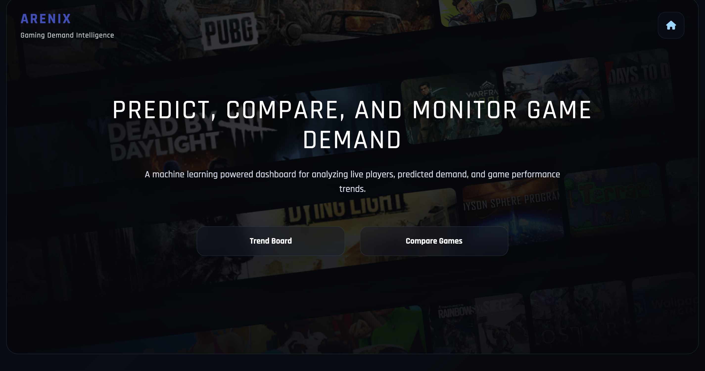 | 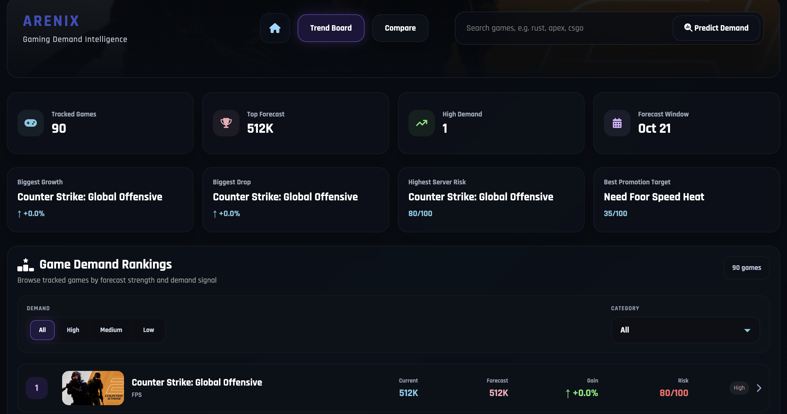 |

| Forecast Result | Prediction Details |
|---|---|
| 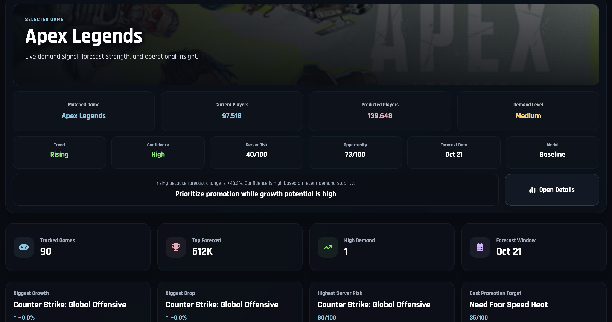 | 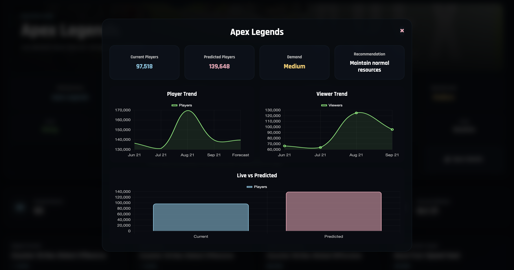 |

| Demand Rankings | Compare Games |
|---|---|
| 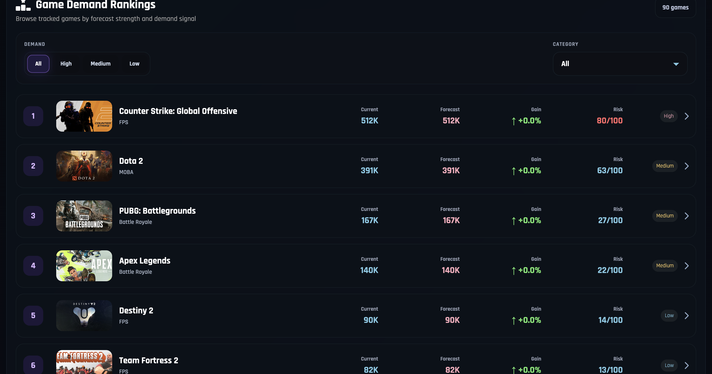 | 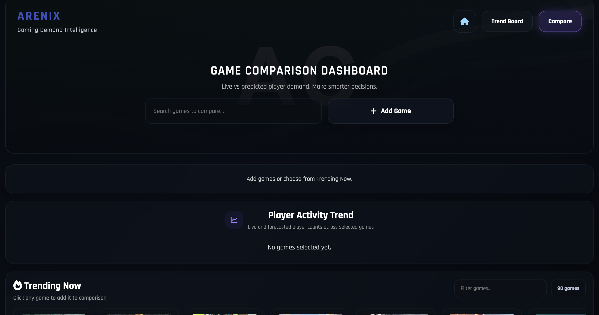 |

| Comparison Chart | Insights View |
|---|---|
| 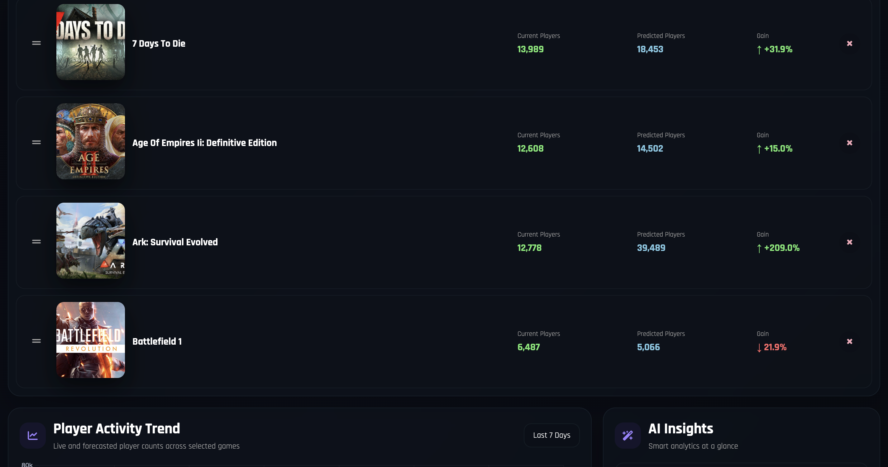 | 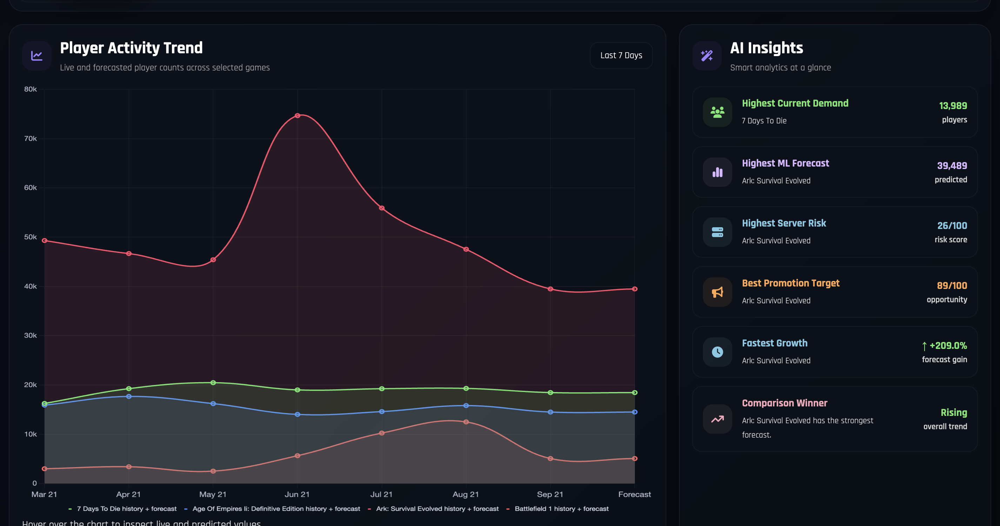 |

| Full Analytics View |
|---|
| 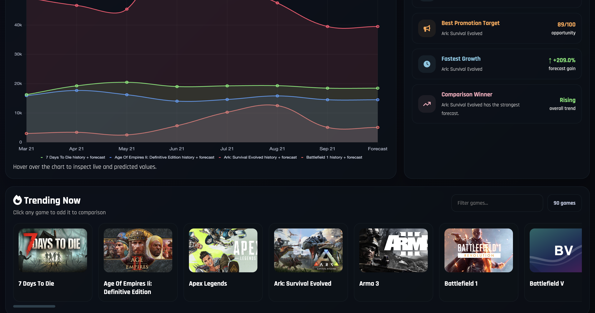 |

### Model and Dashboard Artifacts

| Gaming Dashboard Preview | ML Evaluation Dashboard |
|---|---|
| 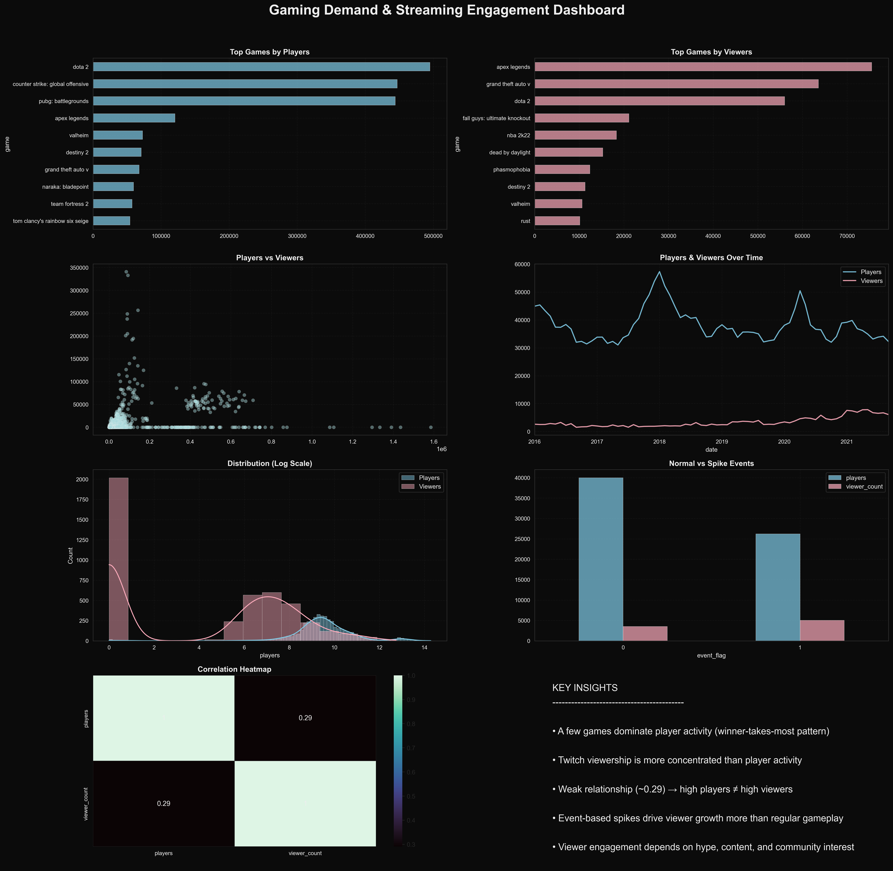 | 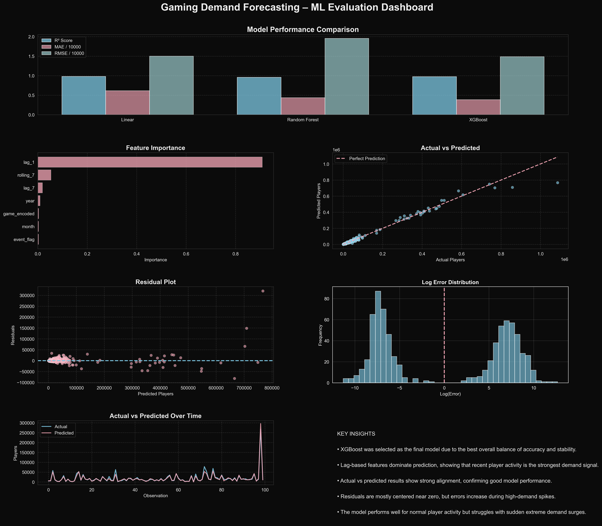 |

## Project Highlights

- Forecasts next-period player demand for supported Steam games.
- Uses historical monthly player activity for demand prediction.
- Compares XGBoost against a lag-based baseline model.
- Selects the best model using time-based validation.
- Displays live Steam player counts when available.
- Includes demand levels, trend labels, server risk, opportunity score, and business recommendations.
- Provides home, dashboard, search, leaderboard, details, and game comparison views.
- Handles unsupported games with clear error responses.
- Includes deployment files for Render/Gunicorn.
- Includes pytest-based regression tests.

## Tech Stack

- Python
- Flask
- Pandas
- Scikit-learn
- XGBoost
- Requests
- HTML
- CSS
- JavaScript
- Chart.js
- Pytest
- Gunicorn

## Dataset

The included dataset is `model_data.csv`.

- Historical range: `2016-08-01` to `2021-09-01`
- Granularity: Monthly
- Target column: `players`
- Main features: `year`, `month`, `event_flag`, `game_encoded`, `lag_1`, `lag_7`, `rolling_7`

Because the bundled historical data ends in September 2021, the model forecasts the next period after the latest available historical row. Live Steam player counts are displayed separately as real-time context.

## Model Approach

The training pipeline compares XGBoost Regressor with a Lag-1 baseline model.

The model is selected using a time-based validation split, which is more realistic for forecasting than random splitting because future data is not mixed into training data.

The training report is saved in `model/training_report.json`.

The selected trained model is saved in `model/final_demand_model.pkl`.

## Main Features

### Demand Forecasting

The app predicts the next-period player count for supported games and returns predicted players, demand level, forecast date, model source, confidence level, trend direction, and recommendation.

### Live Steam Context

The app uses the Steam API to show live player counts when available. If the live API fails or is unavailable, the app falls back to the latest historical player count.

### Trend Board Dashboard

The dashboard shows tracked games, top forecast, high-demand games, game rankings, demand filters, selected game details, and operational recommendations.

### Game Comparison

The comparison page allows multiple games to be compared using historical data and forecasted demand.

### Model Evaluation

The project includes model validation, candidate comparison, selected-model reporting, and saved training metadata.

### Daily Retraining Pipeline

The project includes scripts to collect Steam snapshots, build updated training data, and retrain the model.

Pipeline flow:

```text
Collect Steam player snapshots
        ↓
Save daily snapshot data
        ↓
Build updated model-ready data
        ↓
Retrain the demand model
        ↓
Save updated model and training report
```

## Project Structure

```text
app.py                         Flask routes, APIs, prediction logic
train_model.py                 Model training and validation
demand_model.py                Baseline demand model
game_catalog.py                Supported game names and Steam app IDs
collect_steam_snapshots.py     Collects live Steam player snapshots
build_live_training_data.py    Builds model-ready data from snapshots
run_daily_pipeline.py          Runs the full daily pipeline
validate_model_report.py       Validates model selection report
model_data.csv                 Historical training dataset
model/                         Saved model and training report
templates/                     HTML pages
static/                        CSS styling
tests/                         Regression tests
requirements.txt               Python dependencies
Procfile                       Deployment process file
render.yaml                    Render deployment configuration
runtime.txt                    Python runtime version
Website_screenshots/           Application screenshots
```

## Setup

Clone the repository:

```bash
git clone https://github.com/aishidutta13/AI-realtime-gaming-analytics.git
cd AI-realtime-gaming-analytics
```

Create and activate a virtual environment:

```bash
python3 -m venv .venv
source .venv/bin/activate
```

Install dependencies:

```bash
pip install -r requirements.txt
```

On macOS, XGBoost may require OpenMP:

```bash
brew install libomp
```

## Run the App

```bash
python app.py
```

Open:

```text
http://127.0.0.1:5002
```

## Run Tests

```bash
pytest
```

## Train the Model

```bash
python train_model.py
```

To train using updated live snapshot data:

```bash
python train_model.py --data data/model_data_updated.csv
```

## Run Daily Pipeline

```bash
python run_daily_pipeline.py
```

Useful commands:

```bash
python collect_steam_snapshots.py
python build_live_training_data.py
python run_daily_pipeline.py --skip-collect
```

## API Routes

```text
/                         Home page
/dashboard                Trend board dashboard
/compare                  Game comparison page
/predict/<game>           Prediction API for a game
/dashboard-data           Dashboard ranking data
/compare-games/<games>    Compare multiple games
/recommended-games        Supported game list
```

## Example Use Cases

- Gaming demand forecasting
- Player activity trend monitoring
- Game performance comparison
- Server capacity planning
- Promotion opportunity analysis
- ML model evaluation practice
- Dashboard development practice
- End-to-end analytics product building

## Current Limitations

- The bundled historical dataset ends in September 2021.
- Forecasts are based on the latest available historical row, not the current real-world month.
- Live Steam player counts are used as context, not as the original historical training target.
- Steam API calls may fail or be rate-limited.
- Unsupported games return an error instead of fabricated predictions.
- The app is not deployed publicly yet.

## Future Improvements

- Deploy the dashboard publicly.
- Add more current historical data.
- Add authentication for admin model retraining.
- Add downloadable reports.
- Improve frontend responsiveness.
- Add more advanced time-series models.
- Add CI testing with GitHub Actions.

## Author

Aishi Dutta

GitHub: [aishidutta13](https://github.com/aishidutta13)
```
